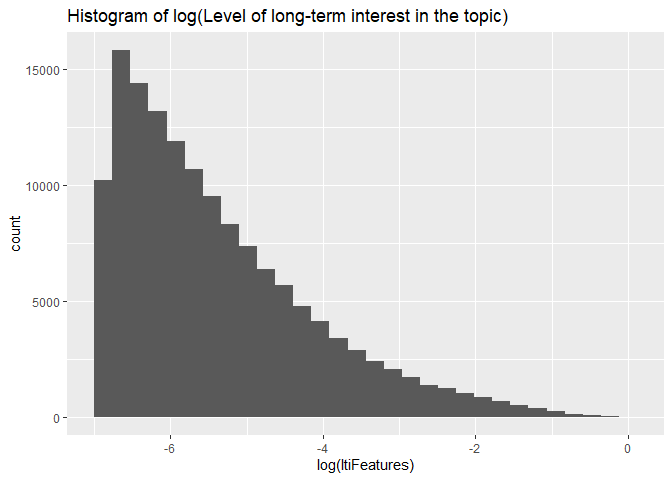
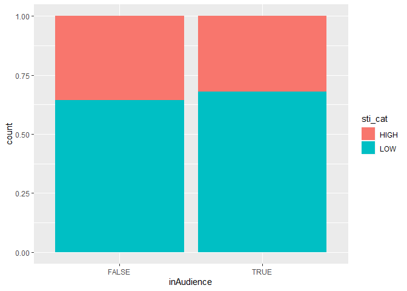
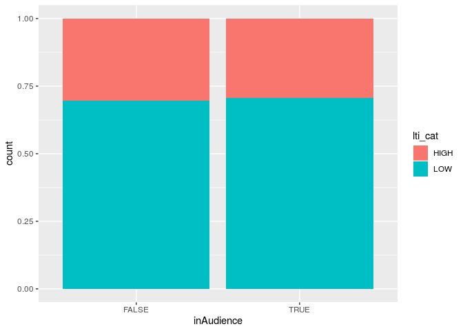
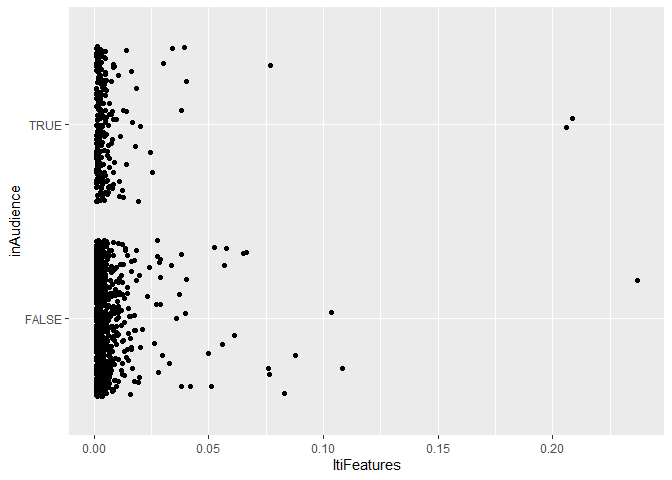
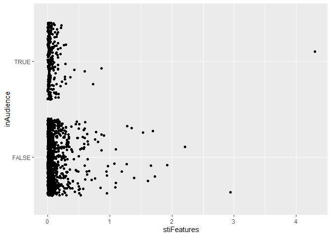

Datathon 2019
================

``` r
library(tidyverse)
```

    ## -- Attaching packages ------------------------------ tidyverse 1.2.1 --

    ## v ggplot2 3.2.1     v purrr   0.3.3
    ## v tibble  2.1.3     v dplyr   0.8.3
    ## v tidyr   1.0.0     v stringr 1.4.0
    ## v readr   1.3.1     v forcats 0.4.0

    ## -- Conflicts --------------------------------- tidyverse_conflicts() --
    ## x dplyr::filter() masks stats::filter()
    ## x dplyr::lag()    masks stats::lag()

``` r
library(broom)
library(knitr)
library(dplyr)
library(skimr)
```

    ## 
    ## Attaching package: 'skimr'

    ## The following object is masked from 'package:knitr':
    ## 
    ##     kable

    ## The following object is masked from 'package:stats':
    ## 
    ##     filter

``` r
library(regclass)
```

    ## Loading required package: bestglm

    ## Loading required package: leaps

    ## Loading required package: VGAM

    ## Loading required package: stats4

    ## Loading required package: splines

    ## 
    ## Attaching package: 'VGAM'

    ## The following object is masked from 'package:tidyr':
    ## 
    ##     fill

    ## Loading required package: rpart

    ## Loading required package: randomForest

    ## randomForest 4.6-14

    ## Type rfNews() to see new features/changes/bug fixes.

    ## 
    ## Attaching package: 'randomForest'

    ## The following object is masked from 'package:dplyr':
    ## 
    ##     combine

    ## The following object is masked from 'package:ggplot2':
    ## 
    ##     margin

    ## Important regclass change from 1.3:
    ## All functions that had a . in the name now have an _
    ## all.correlations -> all_correlations, cor.demo -> cor_demo, etc.

``` r
library(readr)

training = read_csv("training_tallskinny.csv")
```

    ## Parsed with column specification:
    ## cols(
    ##   userID = col_double(),
    ##   inAudience = col_logical(),
    ##   topic_id = col_double(),
    ##   ltiFeatures = col_double(),
    ##   stiFeatures = col_double()
    ## )

``` r
validation = read_csv("validation_tallskinny.csv")
```

    ## Parsed with column specification:
    ## cols(
    ##   userID = col_double(),
    ##   inAudience = col_logical(),
    ##   topic_id = col_double(),
    ##   ltiFeatures = col_double(),
    ##   stiFeatures = col_double()
    ## )

``` r
interest_topics = read_csv("interest_topics.csv")
```

    ## Parsed with column specification:
    ## cols(
    ##   topic_id = col_double(),
    ##   topic_name = col_character()
    ## )

``` r
training <- na.omit(training)
```

``` r
num <- c("303", "304", "305","306","307","308","309","310","311","312","313","314","315")

ce <- training %>%
  filter(topic_id %in% num)
```

``` r
training %>%
  ggplot(aes(x = log(ltiFeatures))) +
  geom_histogram() +
  labs(title = "Histogram of log(Level of long-term interest in the topic)")
```

    ## `stat_bin()` using `bins = 30`. Pick better value with `binwidth`.

<!-- -->

``` r
dataset1 <- training %>%
  mutate(short_interest_level = case_when(
    is.na(stiFeatures) == FALSE ~ stiFeatures,
    is.na(stiFeatures) == TRUE ~ 0
  )) %>%
  mutate(long_interest_level = case_when(
    is.na(ltiFeatures) == FALSE ~ ltiFeatures,
    is.na(ltiFeatures) == TRUE ~ 0
  ))
```

``` r
sti_mean <- dataset1 %>% summarise(mean(short_interest_level))
lti_mean <- dataset1 %>% summarise(mean(long_interest_level))
```

``` r
dataset2 <- dataset1  %>%
  mutate(sti_cat = case_when(
    short_interest_level >= 0.07 ~ "HIGH",
    short_interest_level < 0.07 ~ "LOW"
  )) %>%
  mutate(lti_cat = case_when(
    long_interest_level >= 0.007 ~ "HIGH",
    long_interest_level < 0.007 ~ "LOW"
  ))
```

``` r
dataset2 %>%
  ggplot(aes(x = inAudience, fill = sti_cat)) + 
  geom_bar(position = "fill")
```

<!-- -->

``` r
dataset2 %>%
  ggplot(aes(x = inAudience, fill = lti_cat)) + 
  geom_bar(position = "fill")
```

<!-- -->

``` r
topic <- c("/Computers & Electronics")

fin_topics <- interest_topics %>%
  filter(str_detect(topic_name, "/Finance"))

fin<-training %>%
  filter(topic_id %in% fin_topics$topic_id)

ggplot()+geom_jitter(aes(x= ltiFeatures, y=inAudience), fin)
```

<!-- -->

``` r
ggplot()+geom_jitter(aes(x= stiFeatures, y=inAudience), fin)
```

<!-- -->

``` r
logistic= glm(inAudience ~ ltiFeatures+stiFeatures, data = fin, family = 'binomial')

summary(logistic)
```

    ## 
    ## Call:
    ## glm(formula = inAudience ~ ltiFeatures + stiFeatures, family = "binomial", 
    ##     data = fin)
    ## 
    ## Deviance Residuals: 
    ##     Min       1Q   Median       3Q      Max  
    ## -0.9773  -0.7085  -0.6910  -0.5247   3.8576  
    ## 
    ## Coefficients:
    ##             Estimate Std. Error z value Pr(>|z|)    
    ## (Intercept) -1.24376    0.08074 -15.404  < 2e-16 ***
    ## ltiFeatures 10.27368    4.87560   2.107  0.03510 *  
    ## stiFeatures -1.53664    0.52108  -2.949  0.00319 ** 
    ## ---
    ## Signif. codes:  0 '***' 0.001 '**' 0.01 '*' 0.05 '.' 0.1 ' ' 1
    ## 
    ## (Dispersion parameter for binomial family taken to be 1)
    ## 
    ##     Null deviance: 1327.4  on 1297  degrees of freedom
    ## Residual deviance: 1314.1  on 1295  degrees of freedom
    ## AIC: 1320.1
    ## 
    ## Number of Fisher Scoring iterations: 5

``` r
confusion_matrix(logistic)
```

    ##              Predicted FALSE Predicted TRUE Total
    ## Actual FALSE            1028              0  1028
    ## Actual TRUE              268              2   270
    ## Total                   1296              2  1298
