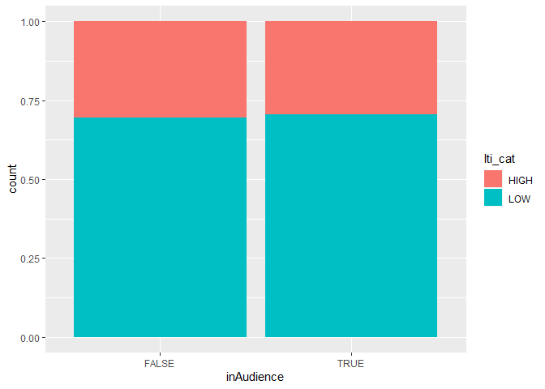

Datathon 2019
================

``` r
library(tidyverse)
```

    ## ── Attaching packages ────────────────────────────────────────── tidyverse 1.2.1 ──

    ## ✔ ggplot2 3.2.1     ✔ purrr   0.3.3
    ## ✔ tibble  2.1.3     ✔ dplyr   0.8.3
    ## ✔ tidyr   1.0.0     ✔ stringr 1.4.0
    ## ✔ readr   1.3.1     ✔ forcats 0.4.0

    ## ── Conflicts ───────────────────────────────────────────── tidyverse_conflicts() ──
    ## ✖ dplyr::filter() masks stats::filter()
    ## ✖ dplyr::lag()    masks stats::lag()

``` r
library(broom)
library(knitr)
library(dplyr)
library(skimr)
```

    ## 
    ## Attaching package: 'skimr'

    ## The following object is masked from 'package:knitr':
    ## 
    ##     kable

    ## The following object is masked from 'package:stats':
    ## 
    ##     filter

``` r
validation <- read.csv("/cloud/project/validation_tallskinny.csv")

training <- read.csv("/cloud/project/training_tallskinny.csv")

interest_topics <- read.csv("/cloud/project/interest_topics.csv")
```

``` r
training <- na.omit(training)
```

``` r
num <- c("303", "304", "305","306","307","308","309","310","311","312","313","314","315")

ce <- training %>%
  filter(topic_id %in% num)
```

``` r
training %>%
  ggplot(aes(x = log(ltiFeatures))) +
  geom_histogram() +
  labs(title = "Histogram of log(Level of long-term interest in the topic)")
```

    ## `stat_bin()` using `bins = 30`. Pick better value with `binwidth`.

<!-- -->

``` r
dataset1 <- training %>%
  mutate(short_interest_level = case_when(
    is.na(stiFeatures) == FALSE ~ stiFeatures,
    is.na(stiFeatures) == TRUE ~ 0
  )) %>%
  mutate(long_interest_level = case_when(
    is.na(ltiFeatures) == FALSE ~ ltiFeatures,
    is.na(ltiFeatures) == TRUE ~ 0
  ))
```

``` r
sti_mean <- dataset1 %>% summarise(mean(short_interest_level))
lti_mean <- dataset1 %>% summarise(mean(long_interest_level))
```

``` r
dataset2 <- dataset1  %>%
  mutate(sti_cat = case_when(
    short_interest_level >= 0.07 ~ "HIGH",
    short_interest_level < 0.07 ~ "LOW"
  )) %>%
  mutate(lti_cat = case_when(
    long_interest_level >= 0.007 ~ "HIGH",
    long_interest_level < 0.007 ~ "LOW"
  ))
```

``` r
dataset2 %>%
  ggplot(aes(x = inAudience, fill = sti_cat)) + 
  geom_bar(position = "fill")
```

<!-- -->

``` r
dataset2 %>%
  ggplot(aes(x = inAudience, fill = lti_cat)) + 
  geom_bar(position = "fill")
```

<!-- -->
